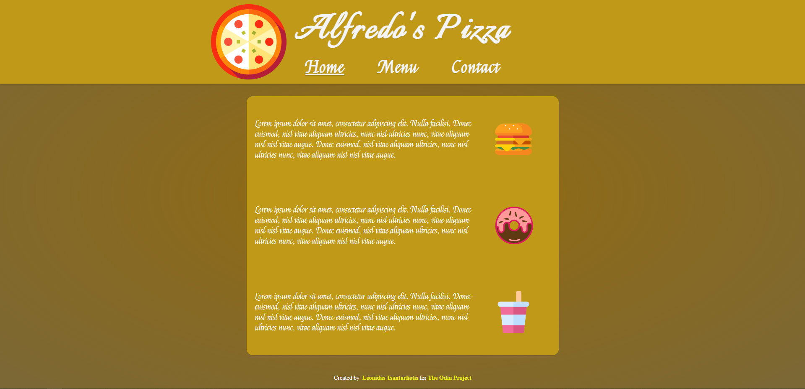

# Restaurant-Page

Live Demo:  
https://leo-tsant.github.io/Restaurant-Page/

## Overview

This project was created for the [Restaurant Page assignment](https://www.theodinproject.com/lessons/node-path-javascript-restaurant-page) as part of [The Odin Project](https://www.theodinproject.com/) curriculum. Features a multi-page website for a fictional restaurant. This project demonstrates the use of JavaScript for DOM manipulation and dynamically rendering content without reloading the page. Each section of the website, such as the home, menu, and contact pages, is rendered using JavaScript.

## Technologies Used

-   **HTML**
-   **CSS**
-   **JavaScript (ES6+)**
-   **Webpack**
